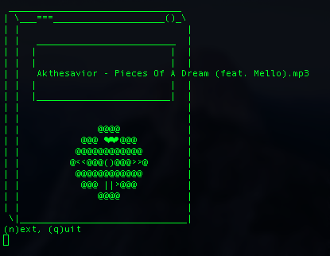

# teapot
 

## A word of caution
The tea isn't finished brewing yet! I'm still in the middle of porting this to Linux, adding features, learning about lisences, and creating a ./config script. This works fine on MacOS right now, but I have a more full-featured version which I'm not publishing yet. Hopefully I will have more time to work on this soon :). Otherwise, enjoy.

## What is teapot?
**teapot** is a recursive acronym, short for *teapot, enjoy a peaceful, open tune*. Legend has it that the *o* actually stands for *oraguntan*, but $CREATOR will never tell. Let's also pretend that the *o* stands for *open* in reference to Open Source, and not because I couldn't think of any other words that start with *o*.

Really, **teapot** is a minimal text-based terminal music player -- noteably with no dependencies (at least I think so :P). As such, **teapot**'s only functionality is to shuffle your music.

## How to set up teapot
**Note:** I'm attempting to abstract this process by creating a script to automatically configure the program. If you're seeing this, don't worry, it will be updated soon.

Firstly, make sure you choose the correct version to download. On MacOS, the default terminal audio player command is *afplay*, while on Linux it's *mpg123* -- to keep you from manually substituting one command for the other depending on your system I went ahead and made two different versions.

Next, move **teapot** to the directory where you keep all of your shell scripts. If you don't have one already, I suggest you see my quick guide on setting up [here](https://github.com/joshnatis/shell-skriptz). Now, make the script executable with the command *chmod +x teapot*.

Lastly, open the script in your favorite editor and change the variable MUSIC_DIR to have the value of the default directory where you keep your audio files. This way, you can simply type **teapot** and have your songs shuffle automatically. 

You're done!

## How to use teapot
Option 1: shuffle songs from your default directory (stored in MUSIC_DIR)
<pre> teapot </pre>
Option 2: shuffle songs from a specified directory
<pre> teapot /path/to/directory </pre>
Now go drink your tea, it's that simple.

## Compatability notes
**teapot** has been tested on multiple computers and shells. Noteably, it works in the Bourne shell (sh), which means it should probably work on whatever you're using. If you find any bugs or have any issues, please reach out to me at:

josh at josh8 dot com
