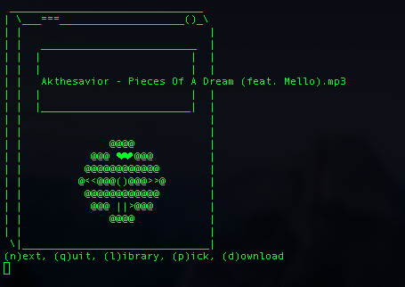

# teapot
 

## A word of caution
The tea isn't finished brewing yet! I'm still in the middle of ~~porting this to Linux~~, adding features, ~~learning about licenses~~, and ~~creating a configuration script~~. This is very much a work in progress. Otherwise, enjoy :)

Also, if you want to watch me explain how the program works (for my own future reference), you can click [here](https://www.youtube.com/watch?v=oJpkSBohS0U).

CURRENT TODO: Fix `pause` time bug, update `configurate` script (or even remove it).

## What is teapot?
**teapot** is a recursive acronym, short for *teapot, enjoy a peaceful, open tune*. Legend has it that the *o* actually stands for *oraguntan*, but $CREATOR will never tell. Let's also pretend that the *o* stands for *open* in reference to Open Source, and not because I couldn't think of any other words that start with *o*.

Really, **teapot** is a minimal text-based command-line music player -- noteably with no dependencies (well, almost). This is not bloatware.

## How to use teapot
Option 1: shuffle songs from your default directory
<pre> teapot </pre>
Option 2: shuffle songs from a specified directory
<pre> teapot /path/to/directory </pre>
Now go drink your tea, it's that simple.

## How to set up teapot
1. `git clone https://github.com/joshnatis/teapot.git`
1. `cd teapot/`
1. `chmod +x configurate`
1. `./configurate`

You're done!

This is what the script does: 
* checks if your operating system is compatible
* checks if you have the prerequisites installed
* asks you for the directory where most of your music files are contained, so that you can simply call `teapot` and have your songs shuffle automatically.
* makes certain that there is no other executable named `teapot` installed (because one exists)
	* if another teapot is installed, our executable is renamed to `teapot2`
* makes the script executable
* asks you for the location of your other shell scripts and moves `teapot` there (or allows you to move the script manually)
* cleans up the mess by deleting the cloned folder and all of its contents

### So you don't want to use the configuration script...
That's okay. Here's what you should do:

1. If you're on MacOS download the file titled `teapot`, otherwise download `teapot4linux` (and if you're on Windows, you're shit outta luck, buddy).

2. Open up the source code in your favorite editor and scroll all the way down to the bottom of the file. You'll see this line `MUSIC_DIR=~/Downloads #default directory of audio files` (line 417 on `teapot`, 421 on `teapot4linux`) -- change the path to your desired directory (one which contains your music files).

3. If you're on MacOS, skip to step 6.

4. Okay Linux peoplez, now that the Apple fanboys are gone we can finally talk about cool things like Ubuntu and hacking Facebook. At this point you need to determine whether you have `ffmpeg` installed (technically you can use any utility that plays audio, but that's up to you to figure out). Also make sure you have `awk` as well. You can check if the utilities are downloaded by typing in `ffmpeg` or `awk`, or `which ffmpeg` or `which awk`.

5. Rename the script to `teapot` (make sure there's no other program installed with the same name)

6. Hi Mac people, you didn't miss much. Now we're all done setting up the script. Make it executable with `chmod +x teapot`.

7. Move the script to a directory where you keep your other shell scripts. If you don't have one, check out my [repository of shell scripts](https://github.com/joshnatis/shell-skriptz) and follow my directions for setting one up. The important thing is for the directory to be specified in your PATH environment variable, so that you can call `teapot` simply by typing `teapot`.

8. That's all, I hope. Don't forget to enjoy!

## Compatability notes
**teapot** has been tested on multiple computers and shells, and linted with [shellcheck](https://www.shellcheck.net/). It was confirmed to work on MacOS, Manjaro Linux, and Arch Linux. It should work in most shells, but when in doubt, use `bash`. If you find any bugs or have any issues, please reach out to me at:

`josh at josh8 dot com`

## Dependencies (and lack thereof)
It was my goal to have **teapot** be free of any dependencies. If you needed ten external libraries installed just to use my program, you'd might as well go ahead and download a full fledged application (maybe even with an ooey gooey GUI... fooey).

On MacOS, **teapot** uses the `afplay`and `afinfo` commands to deal with audio -- these are native to the OS and come installed by default. On Ganoo Linocks (read: any Linux distribution), **teapot** uses `ffmpeg` for the same purposes. This is far from ideal, but, to be fair, if you're a Linux user you probably have `ffmpeg` installed already. The script can also work with `mpg123` (in fact there is a commented line containing the `mpg123` command that can replace `ffmpeg`), or any utility that can play audio (I would have used `aplay` but it only works for raw audio files).

## Licensing
This ware is presented to you with no warranty, but with best wishes.

It is my wish to provide something available for your full use, modification, and redistribution (through preferably with credit when it's applicable) and I have no desire to limit your rights in any way. I do not wish to impose anything on you whatsoever with your use of this software. However, I do put forward my preference that you "pass it forward" by keeping the ware free and open, if you choose to redistribute it. Lastly, I encourage you to contribute to `teapot`'s structural integrity. MIT license.
